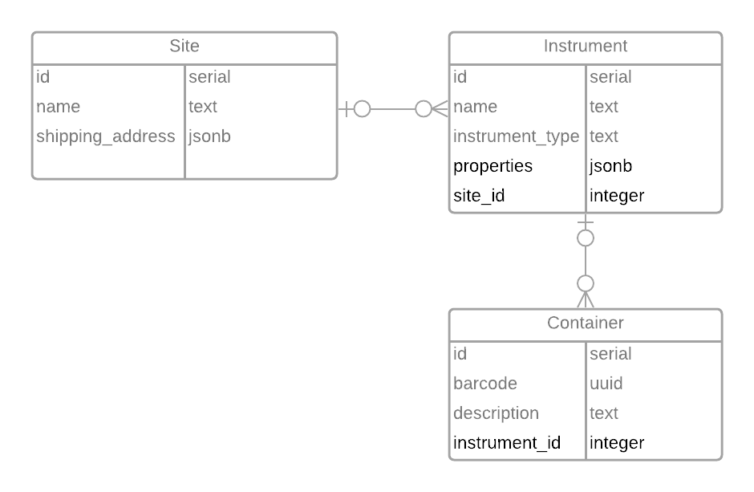

## API Exam
API to query for resources.
## Installation
[](https://github.com/sturlapati-adaptive/api-exam/actions/workflows/docker-image.yml)
### Pre-requisites
1. Docker
### Instructions
1. Clone the source code. 
2. From the command line navigate to the cloned directory.
3. Run the following command: `$ docker-compose -p api-exam up -d`
4. This will build the application image, and set up the postgres database
5. Go to http://localhost:8080/health to verify the application is running. You should the following response
```json
{"status":"UP"}
```
## Build from source *(Optional)*
[](https://github.com/sturlapati-adaptive/api-exam/actions/workflows/gradle.yml)

If you prefer to build the application and/or run the test cases. Use the following instructions.
### Pre-requisites
1. JDK 16
### Instructions
1. Clone the source code.
2. From the command line navigate to the cloned directory.
3. To run tests: `$ ./gradlew test`

## API
The application comes bundled with Swagger UI. You can use that page to **view and execute** the API. 
Once you have the application running go here to access the API docs: http://localhost:8080/swagger-ui
### Seeding data
There is an endpoint to help you seed the data. An example JSON is location in the source code. Please find the site-seed.json
in the location `<application dir>/src/test/resources/site-seed.json` or get it from [here](/src/test/resources/site-seed.json). 
You can use this JSON as request body for the endpoint `POST: /site/seed` 
> If you prefer, you can also use Postman to play with the API instead of the bundled swagger-ui

## Design
The application structure is inspired by domain-driven design. There 3 main domain objects
1. Container
2. Instrument
3. Site

All the business logic for each domain is located in their corresponding *Feature* class. The *Repository* class 
is responsible for database operations. The *Controller* classes are responsible for the HTTP interaction.  


### Pagination
Another design of note is that the API endpoints return a pageable list of objects. For e.g. the endpoint to query for Site resources
returns Site along with its instruments details, where each instrument in turn includes its container details. When the number
of the query results is large then a deeply-nested dataset can lead to a very large payload size and slow performance.
Pagination alleviates the issue with payload size but as a consequence we do sacrifice some performance. To fetch thee related
entities of Sites we make N+1 calls to the database instead of one big SQL query with joins across Site, Instrument and Container tables. 
We could consider using caching or utilize GraphQL to mitigate the such performance issues. For this exam, in the interest of time
this application does not implement caching. 

## Data model and assumptions
There are 3 main tables.
1. Container
   1. The container barcode is assumed to be unique
   2. A container is assumed to exist independently of an instrument and if it belongs to an instrument then it belongs to only one instrument at any given time
   
2. Instrument
   1. There different types of instruments, namely *Computer* and *Freezer*
   2. An instrument is assumed to exist independently of a site and if it belongs to a site then it belongs to only one site at any given time.
   3. Different types of instruments have slightly different properties. If we make them as columns then they don't make sense for the different instrument types. Hence, these properties are modeled as JSONB so that they can have arbitrary properties. e.g. 
```json
{"macAddress": "1309284948"}
```

3. Site
   1. Address of a site is modeled as JSONB instead of a separate table as there are no other entities which have this property. So, for simplification it is modeled as JSONB.



